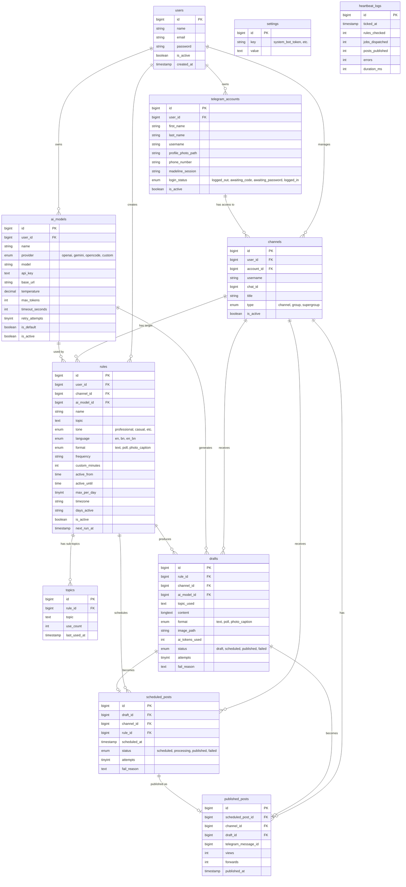

# 🗄️ Telepilot AI Engine - Database ERD

```mermaid
erDiagram
    users {
        bigint id PK
        string name
        string email
        string password
        boolean is_active
        timestamp created_at
    }

    settings {
        bigint id PK
        string key "system_bot_token, etc."
        text value
    }

    ai_models {
        bigint id PK
        bigint user_id FK
        string name
        enum provider "openai, gemini, opencode, custom"
        string model
        text api_key
        string base_url
        decimal temperature
        int max_tokens
        int timeout_seconds
        tinyint retry_attempts
        boolean is_default
        boolean is_active
    }

    telegram_accounts {
        bigint id PK
        bigint user_id FK
        string first_name
        string last_name
        string username
        string profile_photo_path
        string phone_number
        string madeline_session
        enum login_status "logged_out, awaiting_code, awaiting_password, logged_in"
        boolean is_active
    }

    channels {
        bigint id PK
        bigint user_id FK
        bigint account_id FK
        string username
        bigint chat_id
        string title
        enum type "channel, group, supergroup"
        boolean is_active
    }

    rules {
        bigint id PK
        bigint user_id FK
        bigint channel_id FK
        bigint ai_model_id FK
        string name
        text topic
        enum tone "professional, casual, etc."
        enum language "en, bn, en_bn"
        enum format "text, poll, photo_caption"
        string frequency
        int custom_minutes
        time active_from
        time active_until
        tinyint max_per_day
        string timezone
        string days_active
        boolean is_active
        timestamp next_run_at
    }

    topics {
        bigint id PK
        bigint rule_id FK
        text topic
        int use_count
        timestamp last_used_at
    }

    drafts {
        bigint id PK
        bigint rule_id FK
        bigint channel_id FK
        bigint ai_model_id FK
        text topic_used
        longtext content
        enum format "text, poll, photo_caption"
        string image_path
        int ai_tokens_used
        enum status "draft, scheduled, published, failed"
        tinyint attempts
        text fail_reason
    }

    scheduled_posts {
        bigint id PK
        bigint draft_id FK
        bigint channel_id FK
        bigint rule_id FK
        timestamp scheduled_at
        enum status "scheduled, processing, published, failed"
        tinyint attempts
        text fail_reason
    }

    published_posts {
        bigint id PK
        bigint scheduled_post_id FK
        bigint channel_id FK
        bigint draft_id FK
        bigint telegram_message_id
        int views
        int forwards
        timestamp published_at
    }

    heartbeat_logs {
        bigint id PK
        timestamp ticked_at
        int rules_checked
        int jobs_dispatched
        int posts_published
        int errors
        int duration_ms
    }

    %% Relationships
    users ||--o{ ai_models : "owns"
    users ||--o{ telegram_accounts : "owns"
    users ||--o{ channels : "manages"
    users ||--o{ rules : "creates"
    
    telegram_accounts ||--o{ channels : "has access to"
    channels ||--o{ rules : "has target"
    channels ||--o{ drafts : "receives"
    channels ||--o{ scheduled_posts : "receives"
    channels ||--o{ published_posts : "has"
    
    ai_models ||--o{ rules : "used by"
    ai_models ||--o{ drafts : "generates"
    
    rules ||--o{ topics : "has sub-topics"
    rules ||--o{ drafts : "produces"
    rules ||--o{ scheduled_posts : "schedules"
    
    drafts ||--o| scheduled_posts : "becomes"
    drafts ||--o| published_posts : "becomes"
    scheduled_posts ||--o| published_posts : "published as"
```
